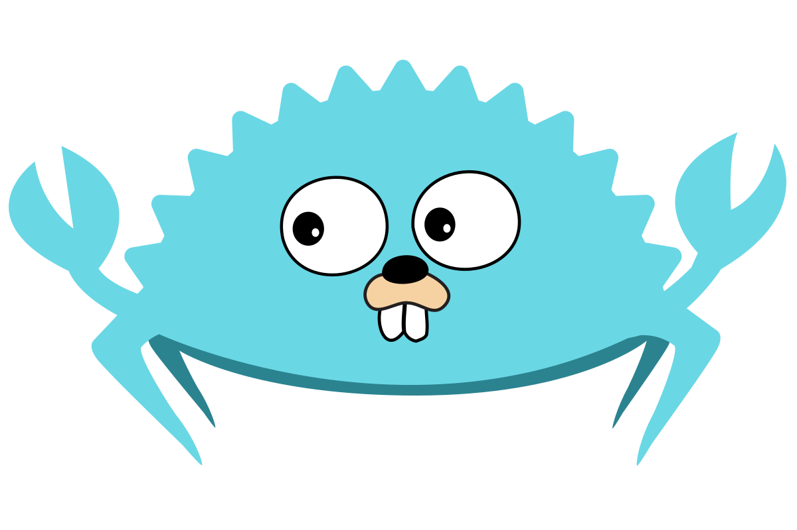

<h1>  Hi there</h1>

<!--
**qianxi0410/qianxi0410** is a ✨ _special_ ✨ repository because its `README.md` (this file) appears on your GitHub profile.
Here are some ideas to get you started:
* 🔭 I’m currently working on ...
* 🌱 I’m currently learning ...
* 👯 I’m looking to collaborate on ...
* 🤔 I’m looking for help with ...
* 💬 Ask me about ...
* 📫 How to reach me: ...
* 😄 Pronouns: ...
* ⚡ Fun fact: ...
-->

- 🔭 I’m currently working on Rust
- 🌱 I’m currently learning front & back end's black magic
- 📫 How to reach me: [here](https://qianx1.xyz)
- 🤔 Manjaro Linux User

西安市&nbsp;&nbsp;晴☀️&nbsp;&nbsp;33℃ 🥵

<h3>  Daily Quotations </h3>

<kbd>2022-06-14</kbd>

When in doubt, tell the truth.   - Mark Twain

<!-- Randomly taken from quotations.md -->

